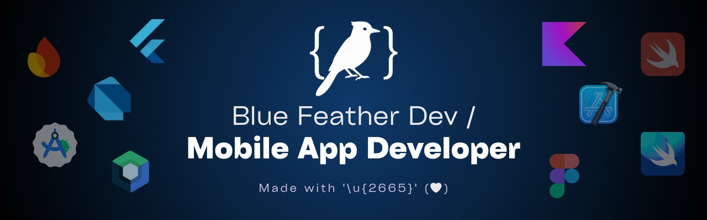

<!-- ¡Hola! 👋 Soy **desarrollador de aplicaciones móviles Android y iOS**.

Estoy en cuarto año de Ingeniería de Sistemas, Colombia; especializádome en el desarrollo de Software, ya que me apasiona el aprendizaje de lenguajes y la creación de experiencias digitales modernas, funcionales y atrayentes.

Actualmente, estoy enfocado en el desarrollo móvil multiplataforma, aprendiendo tecnologías como **Flutter**, **Dart** y **Firebase**. -->

Hi! 👋 I’m a **Software Engineering student** focused on **Android and iOS mobile app development**.  

I’m passionate about learning programming languages and creating modern, functional, and engaging digital experiences.  

At the moment, I’m dedicated to cross-platform mobile development, learning technologies such as **Flutter**, **Dart**, and **Firebase**.

🎯 **Technologies:**

🛠️ **Tools:**

⚙️ **Operating systems:**

<!-- 🔭 **Coming Soon**:

 -->

🧑‍💻 **Social media:**

[_-bluefeather.dev-0F4C75?style=for-the-badge&logo=linktree&labelColor=101010)](https://www.linktr.ee/bluefeather.dev)

[_-jesusdominguez2004-006A71?style=for-the-badge&logo=linktree&labelColor=101010)](https://www.linktr.ee/jesusdominguez2004)

<!-- 

[-bluefeatherdev-000000?style=for-the-badge&logo=x&labelColor=101010)](https://x.com/bluefeatherdev)

 -->

> Made with '\u{2665}' (♥)
