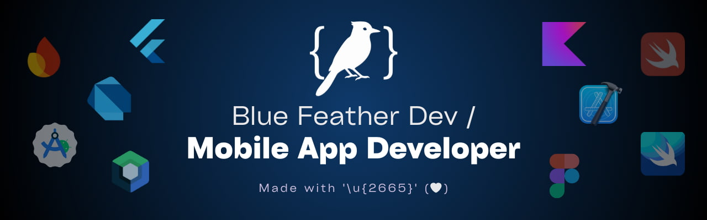

Hi! 👋 I’m a **Software Engineering student** focused on Android and iOS mobile app development.    

I’m dedicated to cross-platform mobile development, learning technologies such as Flutter, Dart, and Firebase. I’m passionate about learning programming languages and creating modern, functional, and engaging digital experiences.

My goal is to create applications that connect people, simplify the way they share meaningful information, and help them organize their lives more effectively. I strive to design solutions that are not only technically solid but also enhance communication and deliver real value to everyday experiences.

🎯 **Technologies:**

🛠️ **Tools:**

⚙️ **Operating systems:**

🧑‍💻 **Social media:**

[_-bluefeather.dev-0F4C75?style=for-the-badge&logo=linktree&labelColor=101010)](https://www.linktr.ee/bluefeather.dev)

[_-jesusdominguez2004-006A71?style=for-the-badge&logo=linktree&labelColor=101010)](https://www.linktr.ee/jesusdominguez2004)

📊 **GitHub summary:**

> Made with '\u{2665}' (♥) by Jesús Domínguez [@bluefeatherdev](https://github.com/bluefeatherdev/)
